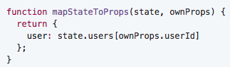
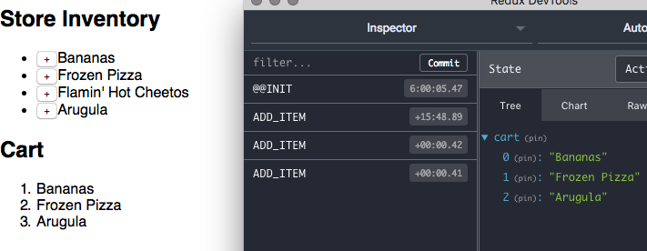

# Super Simple Shopping Cart in Redux

We're going to build a very simple shopping cart that you can add items to.
The complexity of the shopping cart app itself is minimal so as to help us get a feel for integrating Redux into a React app.


## Setup

Clone down this repo.
```bash
 $ git clone git@github.com:ga-wdi-exercises/react-redux-shopping-cart.git
```
By now, you should have `create-react-app` installed on your computer via `npm`.
<details>
<summary>
If you have not, click here.
</summary>

Run the following command:

```bash
 $ npm i -g create-react-app
```
</details>

```bash
 $ create-react-app shopping-cart
 $ npm i -S redux react-redux
```

## Project Structuring

After we've installed these dependencies, let's create directories for `actions`, `components`, `container`, `reducers`, and finally `stylesheets` in the `src` directory.

```bash
 $ mkdir src/actions src/components src/reducers src/containers src/stylesheets
 $ mv src/App.js src/components/App.js
 $ mv src/App.css src/stylesheets/App.css
 $ mv src/index.css src/stylesheets/index.css
```

Next, let's update the import paths for `App` in `index.js` to reflect the new locations of `App.js` and `App.css`.

Finally, we'll update the path for `index.css` in `index.js`.

## Adding a Store

The first step we'll take in integrating Redux with React will be to define a store using `createStore` from `redux`.
`createStore` will take 2 arguments: the program's combined reducers (`rootReducer`), and an initial state. Recall that a store processes changes in application state with reducers.
The store takes in a state, then applies the appropriate **action** via the **reducer**.

Next we'll create a file that defines our store, titled `Store.js`:

```bash
 $ touch src/Store.js
```

in `src/Store.js`:

```js
import {createStore} from 'redux'
import rootReducer from './reducers/RootReducer'

export default (initialState)=>{
  return createStore(rootReducer, initialState)
}
```

Ultimately, a store uses the reducer to apply an action to a state, or more specifically, to a copy of the state.

Stores use **reducers** to determine **which** change or ***action*** to apply to the current application state held in the store. The ***actions*** define ***what*** the change actually is, the ***reducer*** just determines which change to make, or which ***action***.


## Adding in Reducers

```bash
 $ touch src/reducers/RootReducer.js src/reducers/CartReducers.js
```

### Using combineReducers

The combineReducers helper function returns a single, aggregated object.
As its name suggests, combineReducers combines all the reducers into a single object, then returns that object.
We will refer to the returned object as `rootReducer` below.
The values of `rootReducer` will be the reducer functions into a single reducing function you can
pass to createStore.

> in `src/reducers/RootReducer.js`:

```js
import cart from './CartReducers'
import { combineReducers } from 'redux'

// the object returned by this function must have a key named `cart` since `cart`
// will be a *prop* on our Cart container element
const rootReducer = combineReducers({
  cart //ES6 short hand for {cart: cart}
})

export default rootReducer
```

> in `src/reducers/CartReducers.js`:

```js
export default(state = [], action) => {
  switch(action.type){
    case 'ADD_ITEM':
      return [...state, action.item]
    default:
      return state
  }
}
```

[Switch](https://developer.mozilla.org/en-US/docs/Web/JavaScript/Reference/Statements/switch) statement conditionals are used in place of `if`/`else if` conditionals
because they read more cleanly.

## Adding an action

```bash
 $ touch src/actions/CartActions.js
```

> in `src/actions/CartActions.js`:

```js
// Action Creator function
// This action will be called from a button in the UI
export const addToCart = (item) => {

  // This console.log is a side effect and technically makes this function 'impure'.
  // It may come in handy when testing to see if we've integrated redux successfully,
  // to determine if our actions are firing

  console.log(`ACTION: adding ${item} to cart`)
  return {
    //actions must have a type property
    type: 'ADD_ITEM', //action naming conventions: all caps with snake-case (JAVASCRIPT_CONSTANT naming convention )
    item //ES6 shorthand again {item: item}
  }
}
```

Now we've added in the definitive pieces of a working Redux app. Next, we will add in presentational and container components.

## Adding a Presentational Component

```bash
 $ touch src/components/Shelf.js
```

> in `src/components/Shelf.js`:

```js
import React, { Component } from 'react'

class Shelf extends Component {
  constructor(props){
    super(props)
    this.state = {
      shelfItems: [
        "Bananas",
        "Frozen Pizza",
        "Flamin' Hot Cheetos",
        "Arugula"
      ]
    }
  }

  render() {
    const shelfItems = this.state.shelfItems.map( (item, id) => {
      return (
        <li key={id}>
          {item}
          <button onClick={() => this.props.addItem(item)}>+</button>
        </li>
      )
    })
    return (
      <div>
        <h2>Store Inventory</h2>
        <ul>
            {shelfItems}
        </ul>
      </div>
    )
  }
}

export default Shelf
```

## Adding a Container Component

Before we add in a container, let's talk about how Redux interacts with container components and presentational components differently.

> From [Redux Docs: Presentational and Container Components](http://redux.js.org/docs/basics/UsageWithReact.html#presentational-and-container-components)

> Technically you could write the container components by hand using store.subscribe(). We don't advise you to do this because React Redux makes many performance optimizations that are hard to do by hand. For this reason, rather than write container components, we will generate them using the connect() function provided by React Redux, as you will see below.


```bash
 $ touch src/containers/Cart.js
```

> in `src/containers/Cart.js`:

```js
import React, { Component } from 'react'
import { bindActionCreators } from 'redux'
import { connect } from 'react-redux'

import * as CartActions from '../actions/CartActions'
import Shelf from '../components/Shelf'

class Cart extends Component {
  constructor(props){
    super(props)
    this.state = {}
  }

  render() {
    const CartItems = this.props.cart.map( (item, id) => {
      return (
        <li key={id}>
          {item}
        </li>
      )
    })
    return (
      <div>
        <Shelf addItem={this.props.actions.addToCart} />
        <h2>Cart</h2>
        <ol>
          {CartItems}
        </ol>
      </div>
    )
  }
}
// More information about the implementation pattern below can be found at the link below
// https://github.com/reactjs/react-redux/blob/master/docs/api.md#connectmapstatetoprops-mapdispatchtoprops-mergeprops-options

// Subscribes the container component to any changes in Redux-managed state
// the state being mapped to props is the redux state
function mapStateToProps(state, props) {
  return {
    cart: state.cart
  };
}

// Changes in our program will be reflected when new actions are dispatched
function mapDispatchToProps(dispatch) {
  return {
    actions: bindActionCreators(CartActions, dispatch)
  }
}

// typically the lines below would be condensed into :
// export default connect(mapStateToProps, mapDispatchToProps)(Cart)

// returns a wrapper that we need to pass the component into
const connection = connect(mapStateToProps, mapDispatchToProps)

// wraps the Cart component with the store connection configured above
const wrappedComponent = connection(Cart)

export default wrappedComponent

```

In `mapStateToProps`, we're passing in `props` but not using it.
The `Cart` container component will only be receiving props from redux.
Next, we'll head over to `App.js` to add in our new container component.

<details>
  <summary>
    When do you need access to props?
  </summary>
  If we had some kind of information in `props` that was pertinent to the state.
  In the example below, our `props` corresponds to `ownProps`.
  <br>
  
  <br>
  <a href="https://github.com/reactjs/react-redux/blob/master/docs/api.md#the-arity-of-mapstatetoprops-and-mapdispatchtoprops-determines-whether-they-receive-ownprops">
  mapStateToProps in Redux API Docs
  </a>
</details>


## Adding Cart Container to App component

> in `components/App.js`:

```js
import React, { Component } from 'react'
import Cart from '../containers/Cart'

import '../stylesheets/App.css'

class App extends Component {
  render() {
    return (
      <Cart />
    );
  }
}

export default App
```

## Adding App component to Application Root (index.js)


```js
import React from 'react'
import ReactDOM from 'react-dom'
import { Provider } from 'react-redux'
// The Provider is a special type of component.
// The Provider will wrap our App component along with a store that encapsulates
// local states within the App component.

import App from './App'
import Store from './Store'


const StoreInstance = Store()

ReactDOM.render(
  <Provider store={StoreInstance}>
    <App />
  </Provider>,
  document.getElementById('root')
)
```

## Adding in Integration with Chrome Redux Devtools Extension

> in `src/Store.js`:

```js
export default(initialState) => {
  return createStore(
    rootReducer,
    initialState,
    window.__REDUX_DEVTOOLS_EXTENSION__ && window.__REDUX_DEVTOOLS_EXTENSION__()
  )
}
```
Now you should be able to see state changes reflected in Redux Devtools!


