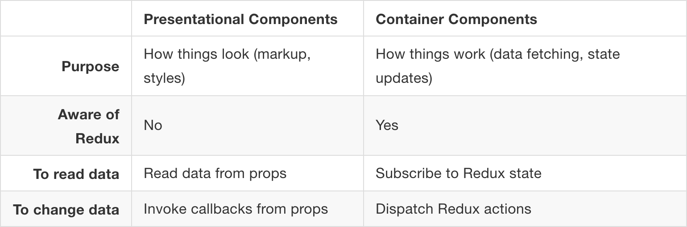

# Super Simple Shopping Cart in Redux

## Setup

By now, you should have `create-react-app` installed on your computer via `npm`. If not, run:

```bash
 $ npm i -g create-react-app
```

```bash
 $ create-react-app shopping-cart
 $ npm i -S redux react-redux
```

After we've installed this dependencies, let's create directories for `actions`, `components`, and `reducers` in the `src` directory.

```bash
 $ mkdir src/actions src/components src/reducers
```

## Adding a Store

Next we'll create a `store.js`

```bash
 $ touch src/store.js
```

in `src/store.js`:

```js
import { createStore } from 'redux'
import rootReducer from './reducers'

export default (initialState)=>{
  return createStore(rootReducer, initialState)
}
```

Ultimately, a store applies an action to a state, or more specifically, to a copy of the state.
Stores use **reducers** to determine **which** change or ***action*** to apply to the current application state held in the store.
***Actions*** define ***what*** the change actually is.


## Adding in Reducers

```bash
 $ touch src/reducers/index.js src/reducers/cart.js
```

### Using combineReducers

> in `src/reducers/index.js`

```js
import cart from './cart'
import { combineReducers } from 'redux'

//stateless components should be defined as functions.

const rootReducer = combineReducers({
  cart //ES6 short hand for {cart: cart}
})
```

> in `src/reducers/cart.js`

```js
export default(state = [], action) => {
  switch(action.type){
    case 'ADD_ITEM'
      return [...state, action.item]
    default:
      return state
  }
}
```

## Adding an action

```bash
 $ mkdir src/action
 $ touch src/action/ADD_TO_CART.js
```

> in `src/actions/ADD_TO_CART.js`

```js
//Action Creator function
//This action will be called from a button in the UI
export const addToCart = (item) => {
  console.log(`ACTION: adding ${item} to cart`)
  return {
    type: 'add',
    item //ES6 shorthand again {item: item}
  }
}
```

Now we've added in the definitive pieces of a working Redux app. Next, we will add in presentational and container components.


```bash
 $ mkdir src/components
 $ touch src/components/shelf.js
```

> in `src/components.js`

```js
import React, { Component } from 'react'

class Shelf extends Component {
  constructor(props){
    super(props)

    this.state = {
      shelfItems: [
        "Bananas",
        "Frozen Pizza",
        "Flamin' Hot Cheetos",
        "Arugula"
      ]
    }
  }
  render() {
    const shelfItems = this.state.shelfItems.map(item, id) => {
      return (
        <li key={id}>
          <button>Add Item</button>
        </li>
      )
    }
    return (
      <div>
      </div>
    )
  }
}

export default Shelf
```

## Adding a Container

Before we add in a container, let's talk about how Redux interacts with container components and components differently.

> From [Redux Docs: Presentational and Container Components](http://redux.js.org/docs/basics/UsageWithReact.html#presentational-and-container-components)

> Technically you could write the container components by hand using store.subscribe(). We don't advise you to do this because React Redux makes many performance optimizations that are hard to do by hand. For this reason, rather than write container components, we will generate them using the connect() function provided by React Redux, as you will see below.



```bash
 $ mkdir src/containers
 $ touch src/containers/shelf.js
```

> in `src/containers/shelf.js`:

```js
import React, { Component } from 'react'
import { bindActionCreators } from 'redux'
import { connect } from 'react-redux'

import * as CartActions from '../actions/cart'
import Shelf from '../containers/shelf'

class Cart extends Component {
  constructor(props){
    super(props)
  }

  render() {
    const CartItems = this.props.cart.map( (item, id) => {
      return (
        <li key={id}>
          {item}
        </li>
      )
    })
    return (
      <div>
        <Shelf addItem={this.props.actions.addToCart} />
        <h2>Cart</h2>
        <ol>
          {CartItems}
        </ol>
      </div>
    )
  }
}

// More information about the implementation pattern below can be found at the link below
// https://github.com/reactjs/react-redux/blob/master/docs/api.md#connectmapstatetoprops-mapdispatchtoprops-mergeprops-options

//Subscribes
function mapStateToProps(state, prop){
  return {
    cart: state.cart
  }
}

//Changes in our program will be reflected when new actions are dispatched
function mapDispatchtoProps(dispatch) {
  return bindActionCreators(CartActions, dispatch)
}

export default connect(mapStateToProps, mapDispatchtoProps)(Cart)
```
